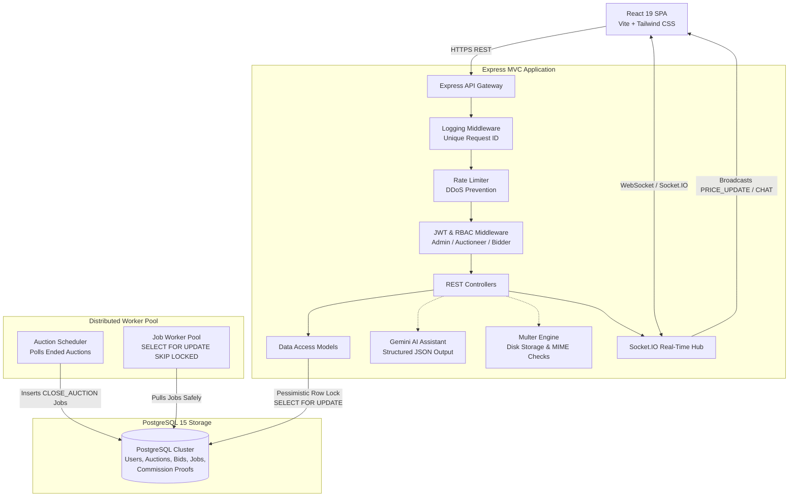

# AuctionLoom ⚡ Real-Time Auction & Distributed Bidding Engine

[](https://nodejs.org/)
[](https://expressjs.com/)
[](https://www.postgresql.org/)
[](https://socket.io/)
[](https://react.dev/)
[](https://www.docker.com/)
[](https://github.com/expressjs/multer)
[](https://deepmind.google/technologies/gemini/)
[](https://github.com/23abhishek2024/auctionloom)
[](https://github.com/23abhishek2024/auctionloom)

[](https://auctionloom.vercel.app/)
[](https://primebid-backend-e971.onrender.com/health)

> 🚀 **Live Production Demo**: [https://auctionloom.vercel.app/](https://auctionloom.vercel.app/)  
> ⚡ **Live Backend API**: [https://primebid-backend-e971.onrender.com/](https://primebid-backend-e971.onrender.com/)  
> 🗄️ **Managed Database**: PostgreSQL on Supabase (Mumbai Cluster)

**AuctionLoom** is a production-grade, distributed real-time auction platform engineered to handle high concurrency, eliminate race conditions (preventing double-bids), and process auction conclusions asynchronously. 

Built strictly following the **MVC (Model-View-Controller)** pattern, **PostgreSQL Pessimistic Row Locking (`SELECT FOR UPDATE`)**, **Distributed Job Queues (`FOR UPDATE SKIP LOCKED`)**, **Bi-directional WebSockets (Socket.IO)**, **Production-Grade Double-Entry Wallet Ledger**, **Multer Multipart Image Processing**, and an **Isolated AI Appraisal Assistant (Google Gemini 3.6 Flash)**.

---

## 🏛️ System Architecture



---

## 🚀 Core Engineering Highlights

### 1. Zero Race Conditions with Pessimistic Row Locking
In high-frequency auctions, two bidders often submit identical or split-second competing bids. Traditional applications suffer from dirty writes and double-winners. 
- AuctionLoom initiates an atomic **ACID Transaction** (`BEGIN`) and locks the target auction row exclusively using **`SELECT * FROM auctions WHERE id = $1 FOR UPDATE`**.
- Concurrent transactions are queued at the database engine level until the current transaction commits (`COMMIT`) or rolls back (`ROLLBACK`), guaranteeing absolute price consistency.

### 2. Instant WebSockets (Socket.IO)
- When a bid passes validation and commits to the database, a **`PRICE_UPDATE`** event is emitted to that auction's isolated room (`JOIN_AUCTION`).
- All active connected browsers receive the new price, bidder identity, and bid history feed instantly with **0 page refreshes**.
- Includes real-time **Live Room Chat** (`CHAT_MESSAGE`) and floating reaction animations (`REACTION`).

### 3. Distributed Background Workers (`FOR UPDATE SKIP LOCKED`)
- **The Scheduler**: Scans for active auctions where `end_time <= NOW()` and queues `CLOSE_AUCTION` jobs into the `jobs` table.
- **The Worker**: Polls using **`SELECT * FROM jobs WHERE status = 'PENDING' FOR UPDATE SKIP LOCKED LIMIT 1`**. Multiple worker processes can run in parallel without ever duplicating or double-processing jobs.

### 4. Production-Grade Wallet & Double-Entry Ledger Architecture
- Implements an enterprise financial ledger following strict double-entry accounting:
  1. **Strict Service Boundary**: All balance modifications are strictly encapsulated inside `walletService.js` (no direct SQL column updates).
  2. **ACID Row Locking (`SELECT FOR UPDATE`)**: Eliminates race conditions and concurrency collisions during simultaneous top-ups, bids, and settlements.
  3. **Zero-Overdraft Invariant (`CHECK balance >= 0`)**: Database and service-level constraints reject any debit exceeding available funds (`INSUFFICIENT_FUNDS`).
  4. **Idempotency Deduplication**: Every transaction requires an `idempotency_key UNIQUE`, guaranteeing retried requests never double-credit or double-debit.
  5. **1-Click Atomic Settlement**: When an auction concludes, the winner settles the hammer price with 1 click; the winner is debited, the seller is credited (net of 5% platform commission), and audit snapshots are recorded in a single database transaction.

### 5. Multer Multipart Image Processing & Local CDN Pipeline
- High-performance multipart image upload engine (`multer.diskStorage`).
- Enforces strict MIME-type allowlists (JPEG, PNG, WebP) and 5MB size guards.
- Automatically generates collision-free timestamped filenames and serves assets via Express static middleware.

### 6. Platform Moderation & Real-Time Administrative Hold
- Super Administrators can immediately freeze suspicious auctions (`RESTRICTED` status).
- The state change broadcasts instantly via WebSocket (`AUCTION_STATUS_CHANGED`), freezing bidding client-side and server-side.
- Administrative force-deletion ensures cascading database cleanup across bids, jobs, and audits.

### 7. AI Auction Assistant (Google Gemini)
- Integrated Google Gemini (`gemini-3.6-flash`) with structured JSON schema prompt engineering.
- Generates optimized auction titles, marketing descriptions, and suggested starting appraisal prices from basic seller keywords.

### 8. Docker Containerization & Multi-Stage Builds
- **Backend**: Alpine Linux container (`node:20-alpine`) with native C++ compilation tools for `bcrypt`.
- **Frontend**: Multi-stage build (`node:20-alpine` builder + `nginx:alpine` runtime), shrinking production image size to **25MB**.
- **Docker Compose**: 1-command startup of 5 microservices (`db`, `backend`, `frontend`, `worker`, `scheduler`).

---

## 📂 Project Structure (Strict MVC)

```text
aution-bid/
├── backend/
│   ├── src/
│   │   ├── controllers/      # authController, auctionController, bidController, aiController,
│   │   │                     # commissionController, walletController, uploadController
│   │   ├── models/           # userModel, auctionModel, bidModel
│   │   ├── routes/           # authRoutes, auctionRoutes, bidRoutes, aiRoutes,
│   │   │                     # commissionRoutes, walletRoutes, uploadRoutes, adminRoutes
│   │   ├── middlewares/      # logger.js, auth.js (RBAC), rateLimiter.js, multer.js
│   │   ├── services/         # socketService.js, aiService.js, walletService.js, topupService.js
│   │   ├── workers/          # jobWorker.js, scheduler.js
│   │   ├── db.js             # PostgreSQL connection pool with cloud SSL support
│   │   ├── app.js            # Express application initialization & middleware chain
│   │   └── index.js          # Node.js Cluster module entry point
│   ├── scripts/
│   │   ├── migrate.js        # Automated schema bootstrap script (npm run migrate)
│   │   └── reset_and_seed.js # Database reset and demo seed script (npm run seed)
│   ├── schema.sql            # Core PostgreSQL schema DDL (Users, Auctions, Bids, Jobs, Wallets)
│   ├── Dockerfile            # Production Node.js Alpine container
│   └── verify_phases.mjs     # 103-assertion automated end-to-end test suite (npm test)
│
├── frontend/
│   ├── src/
│   │   ├── api/client.js     # Axios client with JWT interceptors & walletApi
│   │   ├── context/          # AuthContext.jsx, SocketContext.jsx
│   │   ├── components/       # Navbar, AuctionCard, TopupModal, ProtectedRoute
│   │   ├── pages/            # Dashboard, AuctionDetail (Live Room), CreateAuction,
│   │   │                     # SubmitCommissionPage, AdminDashboardPage, Login, Register
│   │   └── App.jsx           # React Router client-side routing
│   ├── Dockerfile            # Multi-stage production build (Node -> Nginx)
│   ├── nginx.conf            # SPA routing fallback (try_files) & gzip compression
│   └── vercel.json           # Vercel SPA routing rewrite configuration
│
├── workflows/
│   └── ci-cd.yml             # GitHub Actions automated test & build pipeline
├── docker-compose.yml        # Orchestrates db, backend, frontend, worker, scheduler
└── render.yaml               # Infrastructure-as-Code blueprint for cloud deployment
```

---

## 🛠️ Quickstart Guide

### Option A: Run with Docker Compose (Fastest & Recommended)

Make sure [Docker Desktop](https://www.docker.com/) is running, then run:

```bash
# Clone the repository
git clone https://github.com/23abhishek2024/auctionloom.git
cd auctionloom

# Copy environment variables
cp .env.example .env

# Spin up all 5 microservices in 1 command
docker compose up --build
```

- **Frontend**: [http://localhost:3000](http://localhost:3000) or [http://localhost:80](http://localhost:80)
- **Backend API**: [http://localhost:5000](http://localhost:5000)
- **Database**: PostgreSQL on port 5432

---

### Option B: Run Locally (Without Docker)

#### 1. Start PostgreSQL
Ensure PostgreSQL is running locally on port 5432 with database `primebid`.

#### 2. Setup Backend
```bash
cd backend
npm install
npm run migrate    # Automatically creates all tables, indexes, and constraints
npm test           # Runs all 98 automated assertions across 10 phases
npm start          # Starts API server on http://localhost:5000
```

#### 3. Setup Frontend
```bash
cd ../frontend
npm install
npm run dev        # Starts Vite dev server on http://localhost:5173
```

---

## 🧪 Automated Testing Suite (10 Phases, 98 Assertions)

AuctionLoom includes an exhaustive 10-phase verification suite validating every architectural layer:

```bash
cd backend
npm test
```

```text
===========================================================
   AUCTIONLOOM: DETAILED 1 TO 10 PHASE VERIFICATION SUITE   
===========================================================
[Phase 1]  ✅ PASS - Environment & MVC Structure verified
[Phase 2]  ✅ PASS - PostgreSQL Schema & Concurrency Constraints verified
[Phase 3]  ✅ PASS - Core API, JWT Authentication, Rate Limiting & RBAC verified
[Phase 4]  ✅ PASS - Auction CRUD & Pessimistic Row Locking (SELECT FOR UPDATE) verified
[Phase 5]  ✅ PASS - Socket.IO Real-Time Synchronization & Events verified
[Phase 6]  ✅ PASS - Scheduler & Distributed Job Worker (FOR UPDATE SKIP LOCKED) verified
[Phase 7]  ✅ PASS - React 19 Frontend & Real-Time Contexts verified
[Phase 8]  ✅ PASS - Google Gemini AI Auction Assistant verified
[Phase 9]  ✅ PASS - Multer Image Upload & Socket.IO Live Room Chat verified
[Phase 10] ✅ PASS - Production-Grade Wallet & Double-Entry Ledger System verified

===========================================================
   🎉 ALL PHASES (1 TO 10) ARE 100% VERIFIED AND PASSING!  
===========================================================
Total assertions passed: 103/103
```

---

## 🌐 Production Cloud Architecture

AuctionLoom is engineered for decoupled cloud deployment:

| Layer | Provider | Configuration |
|---|---|---|
| **Frontend** | **Vercel** | React Vite SPA on Global Edge CDN. Uses `vercel.json` for client-side routing. |
| **Backend** | **Render** | Dockerized Node.js + Socket.IO server with health check at `/health`. |
| **Database** | **Supabase** | Managed PostgreSQL cluster with connection pooling over SSL (`DATABASE_URL`). |

---

## 🛠️ Database Reset & Demo Seed

To reset your database to a fresh state with clean test accounts and demo luxury auctions at any time:

```bash
cd backend
npm run seed
```

### Pre-Seeded Test Credentials
All test accounts use the password: **`password123`** (or `test@123` depending on seed):

| Name | Email | Password | Role | Capabilities |
| :--- | :--- | :--- | :--- | :--- |
| **Admin** | `admin@gmail.com` | `password123` | Platform Administrator | Restrict/Freeze auctions, delete lots, review proofs |
| **Test1** | `test1@gmail.com` | `password123` | Auctioneer / Seller | Create auctions, upload images, AI appraisals |
| **Test2** | `test2@gmail.com` | `password123` | Auctioneer / Seller | Create auctions, upload images, AI appraisals |
| **Test3** | `test3@gmail.com` | `password123` | Member / Winner | Place bids, win lots, view seller payout coordinates |
| **Test4** | `test4@gmail.com` | `password123` | Member / Bidder | Place bids, real-time live room chat |
| **Test5** | `test5@gmail.com` | `password123` | Member / Bidder | Place bids, real-time reactions |

---

## 📄 License
ISC License. Developed by **Abhishek** ([@23abhishek2024](https://github.com/23abhishek2024)).
