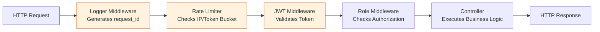
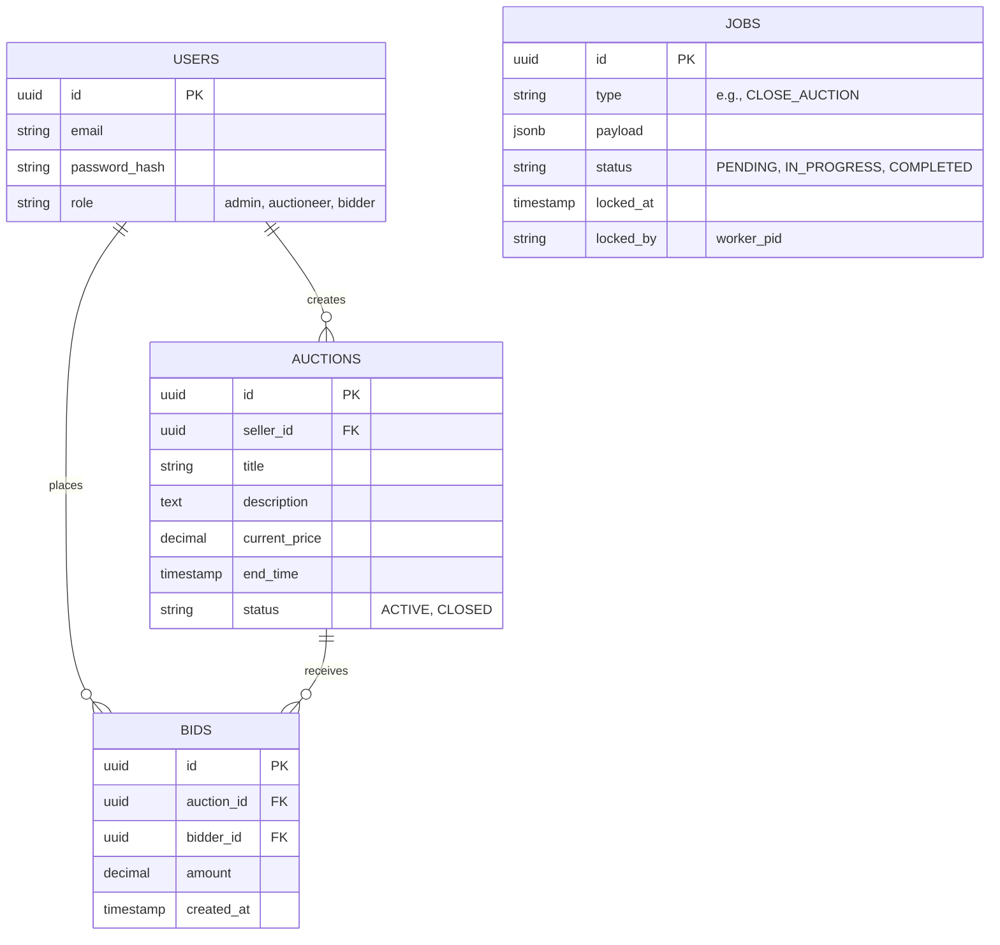
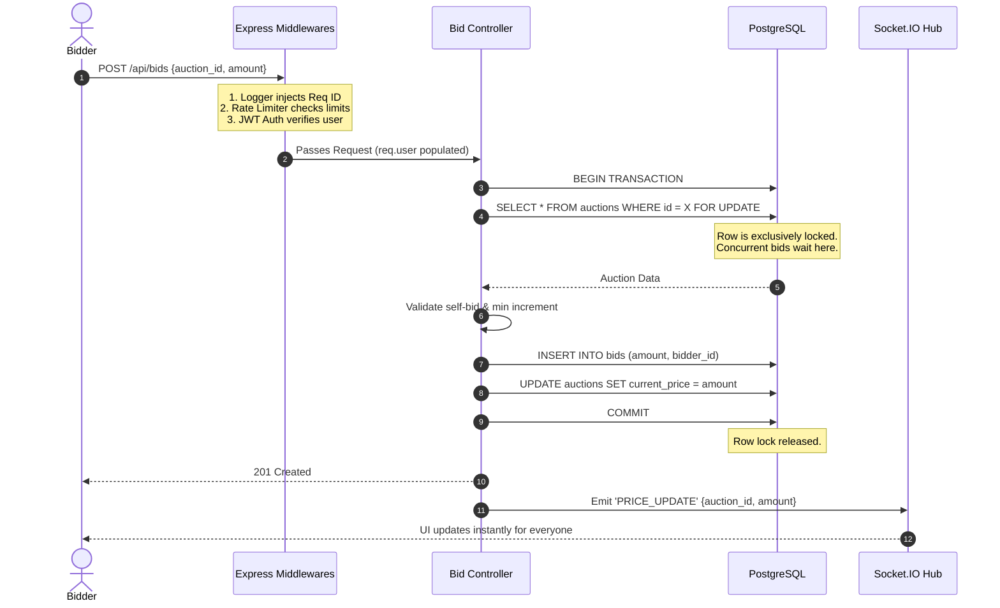
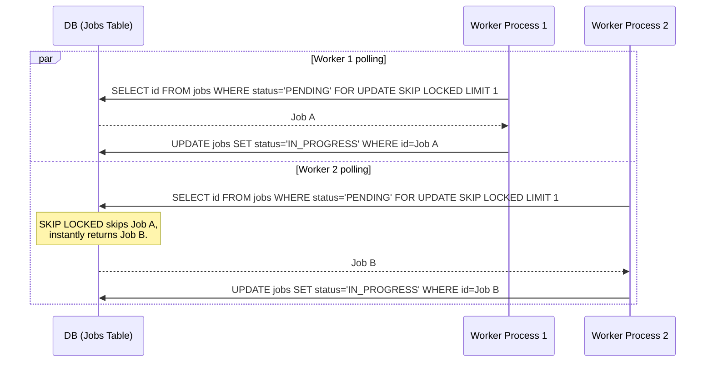
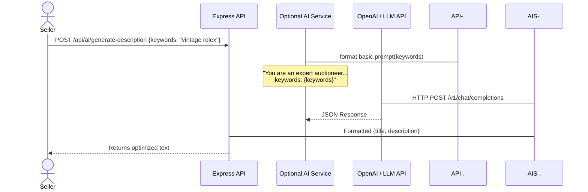

# Prime Bid: Detailed High-Level (HLD) & Low-Level Design (LLD)

## 1. Project Overview & Detailed Description
**Prime Bid** is a highly scalable, real-time auction platform designed to handle high concurrency, prevent race conditions (double-winning), and reliably process auction conclusions. 

The architecture is explicitly designed to demonstrate mastery over modern backend engineering, distributed systems, and generative AI. It strictly follows the **MVC (Model-View-Controller)** pattern, utilizes **Express Middlewares** for cross-cutting concerns (Logging, Auth, Rate Limiting), leverages the **Node.js Cluster module** for high availability, handles distributed background jobs safely using **PostgreSQL**, and optionally features an isolated **AI Assistant** (using basic LLM prompt engineering) to help users generate highly engaging auction descriptions.

---

## 2. High-Level Design (HLD) & Architecture

This architecture demonstrates robust system design principles, containerized via **Docker** for deployment on **AWS ECS**.

```mermaid
graph TD
    %% Clients
    Clients[React Web App] -->|HTTPS REST| LB(Node.js Cluster / Load Balancer)
    Clients <-->|WebSocket / Socket.IO| LB

    %% Node.js App Layer (Clusterized)
    subgraph Express Application (MVC Pattern)
        LB --> Worker1(Express Node 1)
        LB --> Worker2(Express Node 2)
        
        subgraph Middlewares
            Logger[Logging Middleware]
            RateLimiter[Rate Limiter]
            Auth[JWT Auth Middleware]
        end
        
        Worker1 --> Logger
        Logger --> RateLimiter
        RateLimiter --> Auth
        
        Auth --> Controllers(REST Controllers)
        Worker1 --> Socket(Socket.IO Hub)
        Worker1 -.-> AI(Isolated AI Service)
    end

    %% Background Workers
    subgraph Async Workers
        Scheduler(Auction Scheduler)
        JobWorkers(Job Worker Pool)
    end

    %% Data Layer
    subgraph Data Layer
        DB[(PostgreSQL)]
    end

    %% External
    LLM[OpenAI / LLM API]

    %% Connections
    Controllers -->|Read/Write/Lock| DB
    Socket -->|Broadcasts| Clients
    AI -.->|Basic Prompt Engineering| LLM
    Scheduler -->|Poll ended auctions & Insert Jobs| DB
    JobWorkers -->|Poll Jobs SKIP LOCKED| DB
    
    classDef primary fill:#e1f5fe,stroke:#01579b,stroke-width:2px;
    classDef secondary fill:#f3e5f5,stroke:#4a148c,stroke-width:2px;
    classDef database fill:#fff3e0,stroke:#e65100,stroke-width:2px;
    classDef ai fill:#e8f5e9,stroke:#2e7d32,stroke-width:2px;
    
    class Worker1,Worker2,Controllers,Logger,RateLimiter,Auth primary;
    class DB database;
    class Clients secondary;
    class AI,LLM ai;
```

---

## 3. Low-Level Design (LLD)

### 3.1 Folder Structure (Strict MVC Pattern)
The application adheres to the Model-View-Controller architecture, cleanly separating business logic, routing, and data access.

```text
src/
├── index.js              # Entry point: Node.js Cluster module setup
├── app.js                # Express app initialization, Global Middlewares
├── routes/               # API Routes mapping
│   ├── authRoutes.js     # /api/auth
│   ├── auctionRoutes.js  # /api/auctions
│   └── bidRoutes.js      # /api/bids
├── controllers/          # Business logic handlers
│   ├── authController.js
│   ├── auctionController.js
│   └── bidController.js
├── models/               # Postgres DB queries and Data Models
│   ├── auctionModel.js   # Contains "SELECT ... FOR UPDATE" queries
│   ├── bidModel.js
│   └── userModel.js
├── middlewares/          # Express Middlewares
│   ├── logger.js         # Injects request_id and logs traffic
│   ├── auth.js           # Verifies JWT tokens and Roles (RBAC)
│   └── rateLimiter.js    # Prevents spam (System Design principle)
├── services/             # Third-party integrations
│   ├── socketService.js  # Socket.IO broadcasting logic
│   └── aiService.js      # [OPTIONAL] Basic LLM API integration for prompt engineering
└── workers/              # Background Job Processors
    ├── scheduler.js      # Finds ended auctions
    └── jobWorker.js      # Processes "CLOSE_AUCTION" jobs safely
```

### 3.2 Middleware Execution Flow
Every incoming REST API request passes through a rigorous middleware chain before reaching the controller.



### 3.3 Core Database Schema (PostgreSQL)



---

## 4. Key System Workflows

### 4.1 Bid Placement (Concurrency, Middlewares, & Real-time)
This sequence highlights the interaction between Express middlewares, PostgreSQL pessimistic locking, and Socket.IO.



### 4.2 Distributed Job Queue (System Design: Handling Queues)
Demonstrating how workers grab jobs safely without double-processing.



### 4.3 AI Auction Assistant (Optional & Isolated)
An isolated module that can be built last and easily removed if not needed. It utilizes basic Prompt Engineering (direct API calls to an LLM provider) to help sellers generate optimized auction titles and descriptions, without complex RAG or orchestration frameworks.



---

## 5. Technology Stack & Syllabus Alignment

This architecture rigorously implements the concepts mastered in your syllabus:

*   **Frontend**: **ReactJS** (Component architecture, `useState`/`useEffect` hooks, API calling via Axios). *(Note: Next.js is explicitly excluded as requested).*
*   **Backend Application**: **Node.js with Express.js**. Adheres strictly to the **MVC Pattern**. Utilizes the **Cluster module** to scale horizontally across CPU cores.
*   **Express Middlewares**: Deeply integrated custom middlewares for **JWT Authentication**, Authorization (Role checks), **Rate Limiting** (System Design), and Centralized **Logging**.
*   **Database**: **PostgreSQL** (Relational SQL). Implements advanced concurrency controls (`SELECT ... FOR UPDATE SKIP LOCKED`), joins, and aggregations.
*   **Generative AI**: **Isolated Basic Prompt Engineering** for an optional "AI Auction Assistant". Calls standard LLM APIs directly without complex framework overhead. Built as a decoupled final feature.
*   **Real-time Communication**: **Socket.IO** for instantaneous, bi-directional WebSocket broadcasting of price updates.
*   **Deployment & Infrastructure**: **Docker**. Application is containerized and ready for orchestration (e.g., AWS ECS).
*   **System Design Concepts**: Rate Limiting (Token Bucket), Message Queues (Postgres-backed Job Queue), and High Availability patterns.
