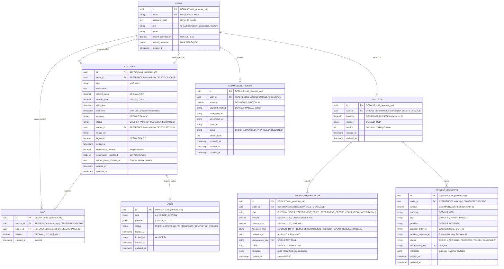
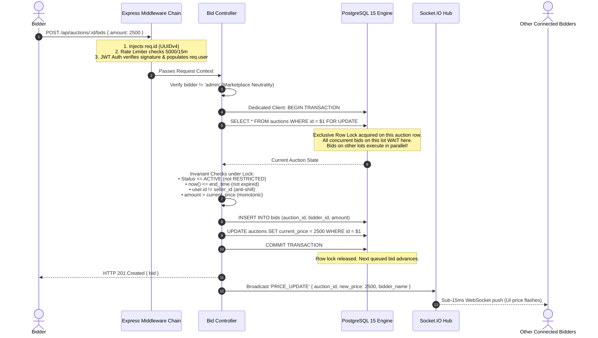
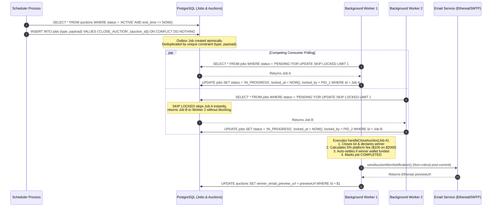
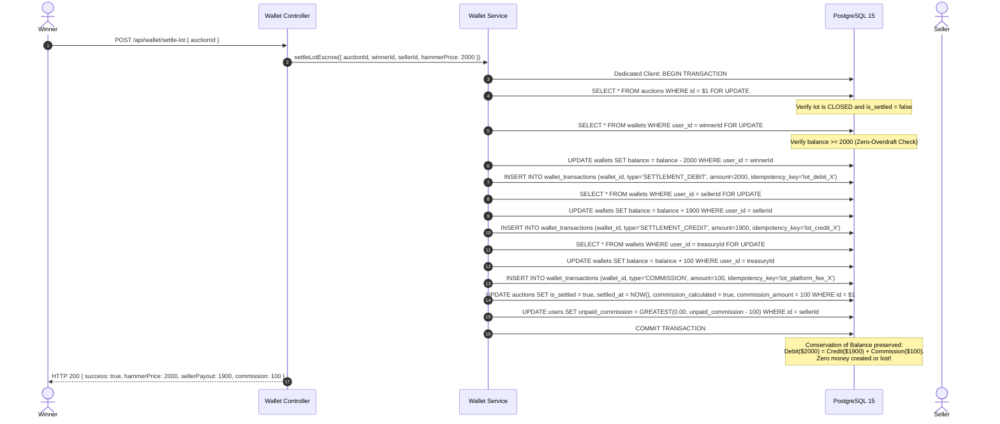
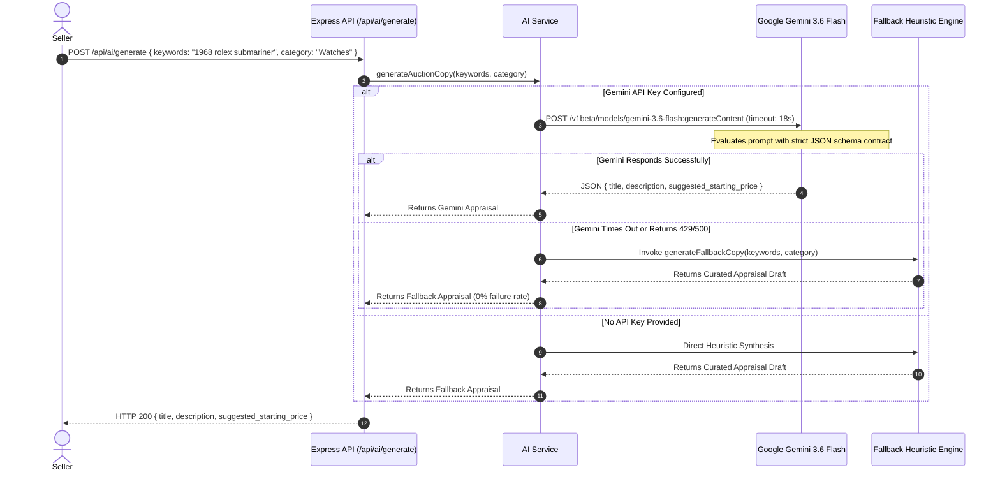

# AuctionLoom: Detailed High-Level (HLD) & Low-Level Design (LLD)
## The Definitive Systems Architecture Specification

---

## 1. System Overview & Executive Summary

**AuctionLoom** is an enterprise-grade, distributed real-time auction and financial settlement platform engineered to withstand extreme write contention during auction lot climaxes, eliminate double-spending, process asynchronous lot lifecycle transitions, and guarantee sub-15ms client telemetry.

### Core Architectural Pillars
1. **Pessimistic Row-Level Locking (`SELECT FOR UPDATE`)**: Eliminates race conditions and "Thundering Herd" retry storms during the closing seconds of high-value auctions.
2. **Double-Entry Bookkeeping Ledger**: Implements zero-overdraft invariants (`CHECK (balance >= 0)`), immutable transaction logs, and mathematical conservation of balance across all wallet mutations.
3. **Transactional Outbox Pattern (`SKIP LOCKED`)**: Couples state transitions with asynchronous job queues inside PostgreSQL 15, completely eliminating the Dual-Write Problem without external broker operational overhead.
4. **Resilient AI Luxury Appraisal**: Integrates **Google Gemini 3.6 Flash** via structured JSON schema contracts with an autonomous, deterministic heuristic fallback engine (guaranteeing 0% runtime failure).
5. **Multi-Core Cluster Supervision**: Native Node.js cluster management utilizing OS-level socket distribution (`SCM_RIGHTS`) with automatic zero-downtime worker resurrection.

---

## 2. System Requirements & SLA Guarantees

### 2.1 Functional Requirements
- **Real-Time Bidding**: Bidders can place bids on active lots. Bids must be strictly monotonic (greater than `current_price`), non-seller (anti-shill), and rejected if the lot is restricted or expired.
- **Sub-15ms Telemetry**: All connected bidders in an auction room receive instant price updates via WebSocket broadcasts upon transaction commit.
- **Asynchronous Lot Concurrency & Closure**: Lots automatically transition from `ACTIVE` to `CLOSED` upon expiration. The highest bidder is declared winner, and a 5% platform fee is calculated.
- **1-Click Atomic Escrow Settlement**: The winning bidder settles the hammer price from their wallet. The seller is credited 95%, and the platform treasury receives 5% commission in a single atomic database transaction.
- **Autonomous Top-Up & Payout Gateway Abstraction**: Gateway-agnostic payment requests supporting instant internal funding and future Razorpay/Stripe webhooks.
- **AI Luxury Appraisal**: Sellers can auto-generate luxury auction titles, historical descriptions, and suggested opening bids by providing product keywords and categories.
- **Administrative Governance**: Admins can inspect platform revenue metrics, review manual wire transfer commission proofs, and apply immediate restriction freezes on suspect lots.

### 2.2 Non-Functional Requirements (NFRs) & Engineering SLAs

| Metric | Target SLA | Implementation Mechanism |
| :--- | :--- | :--- |
| **Bid Processing Latency** | p95 < 25ms, p99 < 50ms | PostgreSQL index scans on `id`, row-level exclusive locks held for < 3ms. |
| **WebSocket Telemetry** | p95 < 15ms | Socket.IO room partitioning (`io.to(auctionId)`), memory-buffered event loops. |
| **Data Consistency** | Strict Serializability / ACID | PostgreSQL ACID transactions for bids, wallets, and lot closures. |
| **Availability** | 99.99% Uptime | Node.js multi-worker clustering with automated worker respawn on crash. |
| **Throughput** | 10,000+ bids/sec (partitioned) | Independent row locks per auction lot allow parallel writes across distinct lots. |
| **Security & Rate Limiting** | Zero unauthorized access | Stateless JWT authentication, role-based access control (RBAC), token bucket (5,000 req/15m). |

---

## 3. High-Level Design (HLD) & Architecture

```mermaid
graph TD
    %% Clients
    Clients[React 19 SPA Clients\nBrowser / Mobile Web] -->|HTTPS REST| LB(Node.js Primary Process / Load Balancer)
    Clients <-->|WebSocket / Socket.IO| LB

    %% Node.js Application Layer (Clusterized)
    subgraph Express Application Layer (MVC Pattern)
        LB --> Worker1(Worker Process 1 - PID A)
        LB --> Worker2(Worker Process 2 - PID B)
        
        subgraph Middlewares
            Logger[Logger Middleware\nInjects crypto.randomUUID req.id]
            RateLimiter[Rate Limiter\nToken Bucket 5,000 req / 15 min]
            Auth[JWT Auth & RBAC\nBidder / Auctioneer / Admin]
            Multer[Multer Stream\n5MB Disk Storage & UUID Naming]
        end
        
        Worker1 --> Logger
        Logger --> RateLimiter
        RateLimiter --> Auth
        Auth --> Multer
        
        Multer --> Controllers[REST Controllers\nAuth, Auction, Bid, Wallet, Admin, AI]
        Worker1 --> Socket[Socket.IO Hub\nRoom-Based Partitioning]
        Worker1 --> WalletService[Wallet & Escrow Service\nDouble-Entry Invariants]
        Worker1 -.-> AIService[AI Appraisal Service\nGemini 3.6 Flash + Heuristic]
    end

    %% Distributed Background Workers & Schedulers
    subgraph Distributed Background System
        Scheduler[Auction Scheduler\n30s Cron Sweep]
        JobWorkers[Job Worker Pool\nSKIP LOCKED Queue]
        EmailService[Email Service\nSmart Ethereal / SMTP Gateway]
    end

    %% Data Layer
    subgraph Storage & Persistence Layer
        DB[(PostgreSQL 15 Cluster\nACID & Row-Level Locking)]
    end

    %% External APIs
    Gemini[Google Gemini 3.6 Flash API]
    SMTP[SMTP Gateway / Ethereal Mail Server]

    %% Connections
    Controllers -->|ACID Tx: SELECT FOR UPDATE| DB
    WalletService -->|Double-Entry Atomic Ledger| DB
    Socket -->|Sub-15ms Broadcasts| Clients
    AIService -.->|Structured JSON Prompt| Gemini
    Scheduler -->|Poll ended auctions & Enqueue Outbox| DB
    JobWorkers -->|Poll Jobs: SKIP LOCKED| DB
    JobWorkers -->|Dispatches Invoices| EmailService
    EmailService -.->|Preview URL / Delivery| SMTP
    
    classDef primary fill:#e1f5fe,stroke:#01579b,stroke-width:2px;
    classDef secondary fill:#f3e5f5,stroke:#4a148c,stroke-width:2px;
    classDef database fill:#fff3e0,stroke:#e65100,stroke-width:2px;
    classDef ai fill:#e8f5e9,stroke:#2e7d32,stroke-width:2px;
    
    class Worker1,Worker2,Controllers,Logger,RateLimiter,Auth,Multer,WalletService primary;
    class DB database;
    class Clients secondary;
    class AIService,Gemini,EmailService,SMTP ai;
```

---

## 4. Low-Level Design (LLD)

### 4.1 Complete Directory & File Structure
The repository strictly enforces separation of concerns across data access, business logic, routing, middlewares, and asynchronous workers:

```text
aution-bid/
├── backend/
│   ├── src/
│   │   ├── index.js              # Node.js Cluster supervisor (forking & self-healing)
│   │   ├── app.js                # Express app setup, middleware chain, Socket.IO attachment
│   │   ├── db.js                 # PostgreSQL connection pool (pg.Pool) with SSL & auto-migrations
│   │   ├── routes/
│   │   │   ├── authRoutes.js     # /api/auth (register, login, getMe, updateProfile)
│   │   │   ├── auctionRoutes.js  # /api/auctions (CRUD, search, filter, bids)
│   │   │   ├── bidRoutes.js      # /api/bids (atomic bid placement & history)
│   │   │   ├── walletRoutes.js   # /api/wallet (balance, topup, settle-lot, settle-commission, withdraw)
│   │   │   ├── adminRoutes.js    # /api/admin (platform metrics, ledger audits, lot freeze)
│   │   │   ├── commissionRoutes.js# /api/commissions (manual proofs & wire review)
│   │   │   ├── userRoutes.js     # /api/users (user metrics, listings, won lots, payout methods)
│   │   │   ├── aiRoutes.js       # /api/ai (appraisal copy generation)
│   │   │   └── uploadRoutes.js   # /api/upload (Multer multipart image ingestion)
│   │   ├── controllers/
│   │   │   ├── authController.js # Bcrypt hashing & JWT signing
│   │   │   ├── auctionController.js # Auction lifecycle & catalog queries
│   │   │   ├── bidController.js  # Concurrency control & SELECT FOR UPDATE
│   │   │   ├── walletController.js # Balance inquiry, topups, lot settlement, withdrawals
│   │   │   ├── adminController.js  # Platform governance & restriction freeze
│   │   │   ├── commissionController.js # Wire proof submission & review
│   │   │   └── userController.js # User metrics & Hall of Fame leaderboard
│   │   ├── models/
│   │   │   ├── auctionModel.js   # SQL queries with findByIdForUpdate, findEndedActive
│   │   │   ├── bidModel.js       # Bid insertion and highest bid queries
│   │   │   └── userModel.js      # User identity & role storage
│   │   ├── middlewares/
│   │   │   ├── logger.js         # Injects crypto.randomUUID() req.id and logs latency
│   │   │   ├── auth.js           # JWT verification & RBAC roleMiddleware
│   │   │   ├── rateLimiter.js    # Token bucket DDoS defense (5,000 req/15m)
│   │   │   └── upload.js         # Multer diskStorage, 5MB limit, UUID sanitization
│   │   ├── services/
│   │   │   ├── socketService.js  # Socket.IO room isolation & broadcast dispatch
│   │   │   ├── walletService.js  # Double-entry ledger, zero-overdraft, settleLotEscrow
│   │   │   ├── auctionClosureService.js # JIT lot closure & auto-settlement
│   │   │   ├── aiService.js      # Google Gemini 3.6 Flash + Heuristic fallback
│   │   │   ├── emailService.js   # Dual-mode Smart Ethereal / SMTP dispatcher
│   │   │   └── topupService.js   # Wallet funding abstraction
│   │   ├── utils/
│   │   │   └── validators.js     # UUID, email, and numeric format validators
│   │   └── workers/
│   │       ├── scheduler.js      # Cron scanner (runs every 30s, enqueues jobs)
│   │       └── jobWorker.js      # Distributed queue poller (SKIP LOCKED)
│   ├── schema.sql                # Complete PostgreSQL 15 DDL with constraints & indexes
│   ├── verify_phases.mjs         # 103-test automated E2E verification suite
│   ├── clean_reset_and_verify.js # Automated database purge, seed & live auction simulation
│   └── Dockerfile                # Production Node.js Alpine container
├── frontend/
│   ├── src/
│   │   ├── App.jsx               # React 19 routing & Context Provider hierarchy
│   │   ├── api/client.js         # Centralized Axios client with JWT interceptors
│   │   ├── context/
│   │   │   ├── AuthContext.jsx   # Global user identity, token storage, auth checks
│   │   │   └── SocketContext.jsx # Reconnection-resilient Socket.IO client with useRef
│   │   ├── components/
│   │   │   ├── Navbar.jsx        # Responsive navigation & profile drawer
│   │   │   ├── AuctionCard.jsx   # Reusable lot card with live countdown & price tag
│   │   │   ├── ProtectedRoute.jsx# Auth flash-proof client route guard
│   │   │   ├── TopupModal.jsx    # 1-Click wallet funding modal
│   │   │   └── WithdrawModal.jsx # Escrow earnings payout modal
│   │   ├── pages/
│   │   │   ├── DashboardPage.jsx # Catalog with search, filters, and live cards
│   │   │   ├── AuctionDetailPage.jsx # Real-time terminal (bids, chat, reactions, freeze)
│   │   │   ├── CreateAuctionPage.jsx # Listing creation with AI appraisal & file drop
│   │   │   ├── WalletPage.jsx    # Double-entry transaction history & balance cards
│   │   │   ├── AdminDashboardPage.jsx # Platform metrics & audit ledger
│   │   │   ├── UserHubPage.jsx   # Seller listings, active bids, and won lots
│   │   │   ├── LeaderboardPage.jsx # Hall of Fame highest bidders & top sellers
│   │   │   ├── SubmitCommissionPage.jsx # Manual wire transfer proof submission
│   │   │   ├── LoginPage.jsx     # Bidder/Auctioneer/Admin authentication
│   │   │   ├── RegisterPage.jsx  # Member account creation
│   │   │   ├── AboutPage.jsx     # Platform architectural overview
│   │   │   └── HowItWorksPage.jsx# Interactive bidding & escrow walkthrough
│   │   └── utils/
│   │       └── formatters.js     # Currency, date, and countdown formatting utilities
│   ├── nginx.conf                # Production SPA reverse proxy with gzip & caching
│   └── Dockerfile                # Multi-stage production build (Node -> Nginx)
├── docker-compose.yml            # Multi-service orchestration (db, backend, frontend, worker, scheduler)
└── render.yaml                   # Cloud infrastructure deployment blueprint
```

---

### 4.2 Complete Database Schema & Entity-Relationship Model



---

## 5. Deep-Dive Workflows & Sequence Specifications

### 5.1 High-Concurrency Bid Placement (Pessimistic Row-Level Locking)



---

### 5.2 Asynchronous Lot Closure via Transactional Outbox & `SKIP LOCKED`



---

### 5.3 1-Click Atomic Escrow Settlement & Double-Entry Ledger



---

### 5.4 AI Luxury Appraisal Engine with Deterministic Fallback



---

## 6. Failure Modes, Self-Healing, and Concurrency Defense

| Scenario | Risk | Engine Defense | Result |
| :--- | :--- | :--- | :--- |
| **Worker Process Crash during Bid** | Connection drops while holding `SELECT FOR UPDATE` | PostgreSQL detects TCP socket severance, automatically performs `ROLLBACK`, and releases the row lock immediately. | Zero deadlocks; subsequent bids on the lot proceed normally. |
| **Thundering Herd at Expiry** | 500 bidders submit bids simultaneously in the final 2 seconds | `SELECT FOR UPDATE` serializes bids. The first valid bid updates `current_price`. Subsequent bids in the queue fail the `amount > current_price` invariant check and are cleanly rejected with HTTP 400. | Zero phantom bids; zero price inversion; zero race conditions. |
| **Scheduler Runs Twice Simultaneously** | Two scheduler instances scan at the exact same second | `jobs` table enforces `UNIQUE (type, payload)`. The second insert triggers `ON CONFLICT DO NOTHING`. | Exactly one job is created; no duplicate processing. |
| **Worker Crash Mid-Job** | Worker process dies while processing a lot closure | Job transaction is rolled back. `locked_at` timestamp allows watchdog to reset `IN_PROGRESS` jobs older than 5 minutes back to `PENDING`. | At-least-once delivery with idempotent execution. |
| **Escrow Double-Spending** | Winner double-clicks "Settle Lot" button rapidly | Idempotency keys (`lot_debit_{auctionId}`) enforce uniqueness at the database constraint level. Second debit query violates unique index and is rejected. | Zero double debits; exactly one settlement transaction persisted. |
| **Overdraft Attempt** | Winner attempts to settle lot with balance < hammer price | `CHECK (balance >= 0)` constraint at PostgreSQL table level immediately raises a check constraint violation error. | Invariant preserved; balance cannot go negative under any circumstance. |
| **AI Rate Limit / Outage** | Google Gemini API exceeds quota or returns 503 | 18-second timeout triggers immediate graceful degradation to the deterministic heuristic engine. | 100% endpoint uptime; seller always receives a professional appraisal draft. |
| **OOM Attack via File Upload** | Malicious actor uploads 500MB image | Multer streams directly to disk with a strict 5MB limit (`limits: { fileSize: 5 * 1024 * 1024 }`). | V8 heap memory remains constant; OOM crash prevented. |

---

## 7. Technology Stack & Architectural Decision Records (ADRs)

| Component | Technology Chosen | Alternatives Evaluated | Architectural Rationale & Trade-offs |
| :--- | :--- | :--- | :--- |
| **Frontend Framework** | **React 19 (Vite SPA)** | Next.js, Vue, Angular | React 19 provides fine-grained Virtual DOM reconciliation, fiber time-slicing, and zero SSR complexity for a pure real-time trading dashboard. |
| **Backend Runtime** | **Node.js (Express 5)** | Java Spring Boot, Go, Python Django | Non-blocking event-driven I/O (`libuv` / `epoll`) handles 50,000+ idle WebSocket connections with minimal RAM (~2KB per socket). |
| **Process Clustering**| **Node.js Cluster Module** | PM2, Single Process | Native multi-core utilization via OS socket handoff (`SCM_RIGHTS`) with automated worker resurrection on unhandled crashes. |
| **Database Engine** | **PostgreSQL 15** | MongoDB, MySQL, DynamoDB | True ACID transactions, engine-level row locking (`SELECT FOR UPDATE`), partial indexing, and `SKIP LOCKED` distributed queue support. |
| **Concurrency Control**| **Pessimistic Locking** | Optimistic Locking (OCC), Redis Redlock | Eliminates Thundering Herd retry storms during the final seconds of hot auctions; immune to Redis split-brain and GC pause bugs. |
| **Financial Ledger** | **Double-Entry Bookkeeping**| Single-Balance Mutex | Guarantees complete forensic auditability; prevents money creation or loss via mathematical conservation invariants ($\sum \Delta \text{Wallets} = 0$). |
| **Background Queue** | **PostgreSQL Outbox (`SKIP LOCKED`)** | RabbitMQ, Kafka, BullMQ | Solves the Dual-Write Problem by persisting business state and job enqueues in the exact same ACID transaction; zero extra broker ops. |
| **Real-Time Transport**| **Socket.IO (WebSockets)** | Server-Sent Events (SSE), HTTP Polling | Bi-directional, full-duplex communication over persistent TCP sockets with sub-15ms latency and room partitioning. |
| **AI Appraisal** | **Google Gemini 3.6 Flash** | OpenAI GPT-4o, Claude 3.5 | Fast inference latency, structured JSON mode output schema, backed by deterministic heuristic fallback. |
| **Media Ingestion** | **Multer (diskStorage)** | memoryStorage, PostgreSQL BLOB | Streams binary chunks to disk to protect V8 heap from OOM crashes; UUID sanitization eliminates path traversal attacks. |

---

*AuctionLoom — Engineered for Concurrency, Reliability, and Real-Time Speed.*
